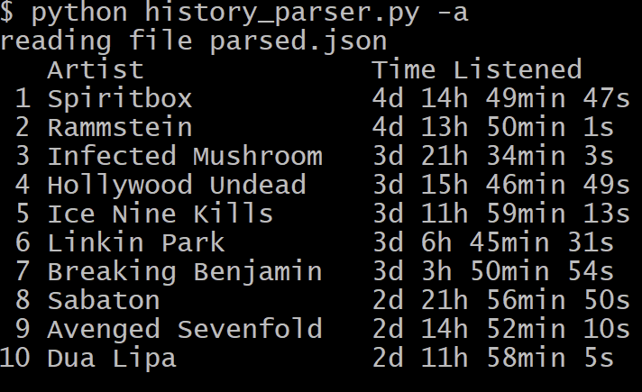

# Spotify Streaming History Parser

A small CLI tool to parse and read spotify streaming data

## How to use

1. Head to the [Spotify privacy settings](https://www.spotify.com/en/account/privacy/) and request your streaming information. You can request streaming data in two ways:
    - Request account data. This only includes the streaming history of the past year
    - Request extended streaming history.
2. Once you have the data, move the related files to the src/data folder
    - If you requested the account data, the StreamingHistory_music_X.json files contain the streaming history
3. navigate to the ```src``` folder
4. run ```python history_parser.py```

This should generate output that looks something like the following:


## CLI options
### -h / --help
Show a help message listing the different options.

### -a / --artists
Show artist statistics instead of tracks.


### -c COUNT / --count COUNT
Change the amount of results to show. Default is 10.


### -e / --extra
Show extra information about track statistics. (estimated) Track length, timestamps of the first and last listen within the year filter.


###  -k KEYWORD / --keyword KEYWORD
Keyword search filter. The used keyword can match either the artist or track name.


### -s {time,count} / --sortKey {time,count}
Sort results based on Play count or Total play time. Default is count


###  -y YEAR (YEAR) / --year YEAR (YEAR)
Filter results by year or range of years.


